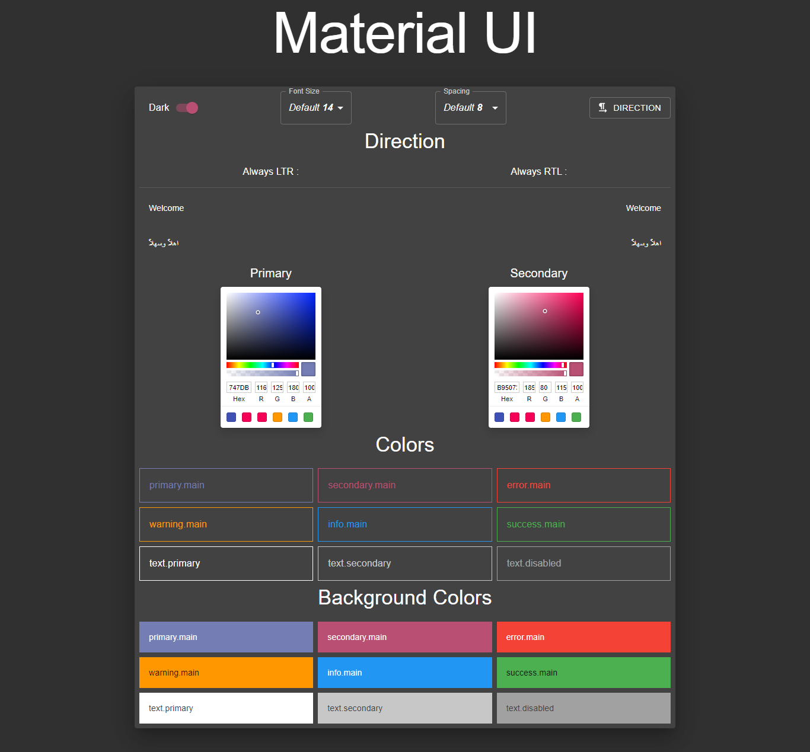

# Material UI React Theme Editor

Material UI responsive design with ability to edit theme properties and RTL support.

## Table Of Contents

- [Material UI React Theme Editor](#material-ui-react-theme-editor)
  - [Table Of Contents](#table-of-contents)
  - [Install Dependencies](#install-dependencies)
  - [Quick Start](#quick-start)
  - [Demo](#demo)
  - [Screenshot](#screenshot)
  - [App Info](#app-info)
    - [Author](#author)
    - [Version](#version)
    - [License](#license)

## Install Dependencies

```bash
npm install
```

## Quick Start

```bash
npm start
```

## Demo

[Demo](https://github.com/Technology-Geek.github.io/Material_UI_React_Theme_Editor)

## Screenshot



## App Info

### Author

[Technology-Geek](https://github.com/Technology-Geek)

### Version

1.0.0

### License

This project is licensed under the **MIT License**
